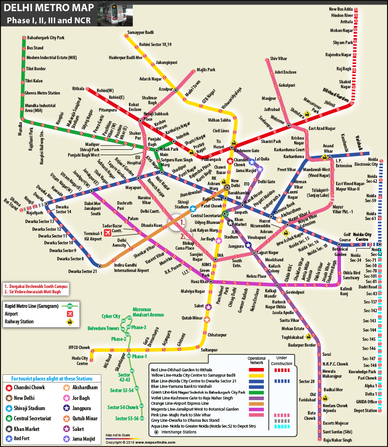

# **Text Search In Image**
## **Introduction** 

Sometimes, It is difficult to search for a piece of information in an image with multiple text with different size,font,gradient,orientation. Unlike pdfs, we can not auto-search for these content in the image. This Project aims to convert the image into a pdf with copyable text at the same loaction in the image.  

Example:

This is a Delhi Metro Map. People do strugle to get the desired location in the map.

## **How is it helpful?**
1. **Easy Search:** Searching through image with full of content 
2. **Storage:** Documents can be stored in form of images (less space and easy to upload)
3. **Evaluation:** Handwritten text can be converted into pdf for auto-evaluation 
4. **Alter Text:** Text font can be changed as per convience of user. Changing color of text helps color blind people to see the text.
5. **Disoriented Text:** Identifying Disoriented or Distorted text.

## **Milestone**

| Milstone | Detail |
|--|--|
|Milestone 0| Increase Image Quality |
|Milestone 1| Text Extraction |
|Milestone 2| Create Contour Boxes around Identified Text|
|Milestone 3| Preprocess extracted Contour boxes|
|Milestone 4| OCR on Extracted image|
|Milestone 5| Create Similar Image With no Text|
|Milestone 6| Convert the Image from Milestone 5 into PDF|
|Milestone 7| Write extracted text on the pdf with correct orientation|

## **Implementation**
1. **Milestone 0**

    1. **Python PIL** Library allow to increase the dpi of the image

2. **Milestone 1**
    
    1. **SWT (Stroke Width Transformation)** : http://www.math.tau.ac.il/~turkel/imagepapers/text_detection.pdf

3. **Milestone 2**

    1. 

4. **Milestone 3**

    1. 

5. **Milestone 4**

    1. **Tesseract OCR**

6. **Milestone 5**

    1. **Python PIL** Library

7. **Milestone 6**

    1. Mask the extracted text image in the original image

8. **Milestone 7**

    1. 

## **Deadline**

| Date | Event |
|----|-----|
|4 August |Preparing Dataset|
|5 August |Milestone 0|
|15 August|Milestone 1|
|20 August|Milestone 2|
|31 August|Milestone 3|
|10 September|Do the left-over work|
|12 September|Milestone 4|
|18 September|Milestone 5|
|21 September|Milestone 6|
|25 September|Milestone 7|
|30 September|Do the left-over Work|
|5 October| Testing|
|10 October| Documentation|

## **Resources Required**

1. Subscription to medium and IEEE xplore to read more informational Blogs

## **Future Scope**
1. Identification different language images
2. Mobile API to use the tool with ease

## **Our Team**
1. Harsh Goyal
2. Tejal Kulkarni

